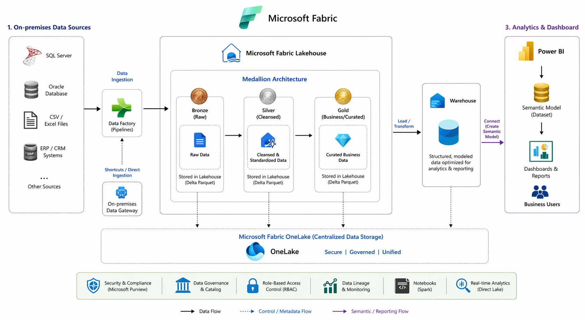
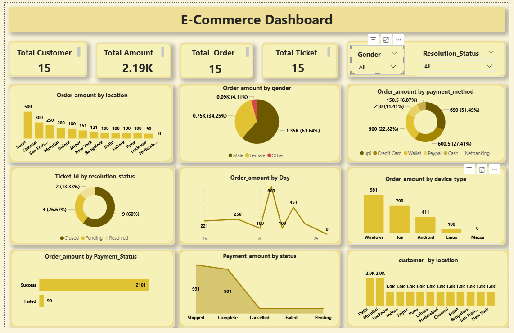

# Microsoft Fabric Medallion Architecture Data Pipeline

## Project Overview

This project demonstrates an end-to-end modern data architecture using
Microsoft Fabric. The solution ingests on-premises datasets, processes
them using the Medallion Architecture (Bronze, Silver, Gold) in
Microsoft Fabric Lakehouse, stores curated data in a Fabric Data
Warehouse, and finally creates interactive dashboards using Power BI
Semantic Models.

------------------------------------------------------------------------

## Architecture Diagram

Add your architecture diagram image in this repository and reference it
like below:

------------------------------------------------------------------------

## Data Pipeline Flow

On-Premises Sources
        │
        ▼
Data Ingestion (Data Factory)
        │
        ▼
Fabric Lakehouse
        │
        ├── Bronze Layer (Raw Data)
        ├── Silver Layer (Cleaned Data)
        └── Gold Layer (Business Data)
        │
        ▼
Fabric Data Warehouse
        │
        ▼
Power BI Semantic Model
        │
        ▼
Power BI Dashboards

------------------------------------------------------------------------

## Project Structure

Microsoft-Fabric-Medallion-Architecture
│
├── Architecture-Diagram
│   └── fabric-architecture.png
│
├── On-Premises Sources
│   └──  customers.csv
|   └──  orders.csv
|   └──  payments.csv
|   └──  support_tickets.csv
|   └──  web_activities.csv
│
├── Lakehouse
│   ├── bronze-layer
│   ├── silver-layer
│   └── gold-layer
│
├── Data-Warehouse
│   └── warehouse-schema.sql
│
├── Power BI
│   └── dashboard.pbix
│
└── README.md

-------------------------------------------------------------------

## Architecture Components

### 1. On-Premises Data Sources

Example sources: - SQL Server - Oracle Database - CSV / Excel files -
ERP / CRM systems - Other enterprise databases

------------------------------------------------------------------------

### 2. Data Ingestion

Data is ingested into Microsoft Fabric using:

-   Fabric Data Factory Pipelines
-   On-Premises Data Gateway
-   API / File ingestion pipelines
-   Fabric Data Flow

The raw data is stored inside OneLake within the Fabric Lakehouse.

------------------------------------------------------------------------

### 3. Medallion Architecture

#### Bronze Layer (Raw Data)

-   Raw data from source systems
-   Minimal transformation
-   Stored in Delta Lake format

Example tables: - orders_raw - customers_raw - payments_raw

#### Silver Layer (Cleaned Data)

-   Data cleansing
-   Removing duplicates
-   Standardizing schema

Example tables: - orders_clean - customers_clean - payments_clean

#### Gold Layer (Business Data)

-   Aggregated datasets
-   Business-ready tables
-   Optimized for reporting

Example tables: - orders_summary - customer_analytics - payment_metrics

------------------------------------------------------------------------

### 4. Microsoft Fabric Data Warehouse

Curated Gold Layer data is loaded into Fabric Warehouse.

Example schema: - Factordrs - DimCustomer - Dimpayment - Dimsupport_tickets - Dim web_activities

Benefits: - Optimized analytics queries - Structured relational model -
High performance reporting

------------------------------------------------------------------------

### 5. Power BI Semantic Model

The semantic model defines: - Table relationships - Business measures
using DAX - Business-friendly data model

Example measures:

Total Order = SUM(FactOrder\[Order_amount\])

------------------------------------------------------------------------

### 6. Power BI Dashboard

Power BI dashboards provide business insights such as:

## KPI

-   Total Order
-   Total Amount
-   Total Ticket
-   Total Customer

## ### Visualizations

-   Sales Performance KPIs
-   Revenue Trends
-   Customer Analytics
-   Product Performance
-   Regional Sales Analysis

---------------------------------------------------------------------------

### 7. Power BI Dashboard Perview

--------------------------------------------------------------------------
## Technologies Used

-   Microsoft Fabric
-   Data Factory
-   OneLake
-   Lakehouse
-   Delta Lake
-   Spark
-   SQL
-   Power BI
-   DAX

------------------------------------------------------------------------

## Microsoft Fabric Services Used
**Service	                                Purpose**
Data Factory	                        Data ingestion pipelines

OneLake	                                Centralized storage

Lakehouse	                        Data engineering and transformation

Spark Notebooks	                        Data processing

Data Warehouse	                        Structured analytics storage

Power BI	                        Data visualization

Semantic Model	                        Business data modeling
------------------------------------------------------------------------

## Author

Data Engineering Portfolio Project -- Microsoft Fabric Architecture
